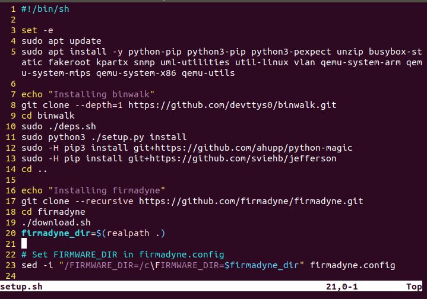

在Ubuntu18上模拟路由器，首选`qemu`和`firmadyne`

现在我对这俩玩意的理解就是，

- `qemu`是一款虚拟操作系统模拟器，

- `firmadyne`是一款自动化固件逆向框架，包含四个组件：

  - 1、爬虫组件：从各大厂商特定的固件服务器上面爬取不同设备、不同版本的固件，并下载到本地存储。
  - 2、解压组件：通常固件会经过某种手段压缩为镜像格式文件，此组件主要用于将镜像还原为标准的文件系统。（binwalk）
  - 3、模拟组件：利用 qemu 模拟成功还原的固件，构造合适的虚拟硬件环境以支持固件运行。
  - 4、动态分析组件：利用已知的 poc 或 fuzz 等技术对成功模拟的固件进行安全测试，将发现的漏洞等存档。

  还对`NVRAM`进行支持

### 安装`qemu`

采用源码安装法（如果是安装`firmadyne`，不需要单独安装）

首先下载源码：

```bash
wget https://download.qemu.org/qemu-5.0.0.tar.xz
```

安装依赖包：

```bash
sudo apt-get install git libglib2.0-dev libfdt-dev libpixman-1-dev zlib1g-dev
```

编译安装：（耗时较长）

```bash
tar xvJf qemu-5.0.0.tar.xz
cd qemu-5.0.0
./configure
make
make install //可能需要sudo
```

安装完成后进行测试：

```bash
panda@ubuntu:~$ qemu-system-arm --version
QEMU emulator version 5.0.0
Copyright (c) 2003-2020 Fabrice Bellard and the QEMU Project developers
panda@ubuntu:~$ 
```


### 安装`firmadyne`

这个原仓库已经很久不更新了，这里使用的是`firmware-analysis-plus`

[liyansong2018/firmware-analysis-plus: 开源固件仿真平台，使用 firmadyne 一键模拟固件 (github.com)](https://github.com/liyansong2018/firmware-analysis-plus)

```bash
git clone https://github.com/liyansong2018/firmware-analysis-plus.git
cd firmware-analysis-plus
./setup.sh
```

安装成功后（包括`binwalk`）测试一下，使用的是`DIR859Ax_FW105b03.bin`

```
panda@ubuntu:~/firmware-analysis-plus$ ./fat.py /home/panda/Desktop/router/DIR859Ax_FW105b03.bin 

             
		______   _                ___                 
		|  ___| (_)              / _ \                
		| |_     _   _ __ ___   / /_\ \  _ __    ___  
		|  _|   | | | '_ ` _ \  |  _  | | '_ \  / __| ++
		| |     | | | | | | | | | | | | | | | | \__ \ 
		\_|     |_| |_| |_| |_| \_| |_/ |_| |_| |___/

                Welcome to the Firmware Analysis Plus - v2.0
            By lys - https://blog.csdn.net/song_lee | @liyansong
    
[+] Firmware: DIR859Ax_FW105b03.bin
[+] Extracting the firmware...
[+] Image ID: 1
[+] Identifying architecture...
[+] Architecture: mipseb
[+] Building QEMU disk image...
[+] Setting up the network connection, please standby...
/home/panda/firmware-analysis-plus/firmadyne/scripts/inferNetwork.sh
---------
['1', 'mipseb']
---------
/home/panda/firmware-analysis-plus/firmadyne
[+] Network interfaces: []
[+] All set! Press ENTER to run the firmware...
[+] When running, press Ctrl + A X to terminate qemu

```

----------------------分界线----------------------

这里是安装`FAT`不过没有成功

```bash
git clone --recursive https://github.com/attify/firmware-analysis-toolkit.git
```

进入到`firmware-analysis-toolkit`目录中，打开`setup.sh`脚本，可以看到自带的有安装`binwalk`指令（7-14行）这里我已经提前安装`binwalk`所以注释掉这一部分（看网上教程说这几步执行的时候会被卡住，没有验证）




### 安装`binwalk`

克隆的速度很慢，可以先下载，然后执行2-4行命令

```bash
git clone https://github.com/ReFirmLabs/binwalk.git
cd binwalk
./dep.sh
sudo python3 setup.py install
```

仓库也可以使用：（这个仓库配合上面的`FAP`）

https://github.com/liyansong2018/binwalk.git

卸载：

```bash
sudo python3 setup.py uninstall
```


参考链接：

[firmadyne 简单使用指南 & 模拟示例 | CataLpa's Home (wzt.ac.cn)](https://wzt.ac.cn/2020/01/08/iot_brief/)