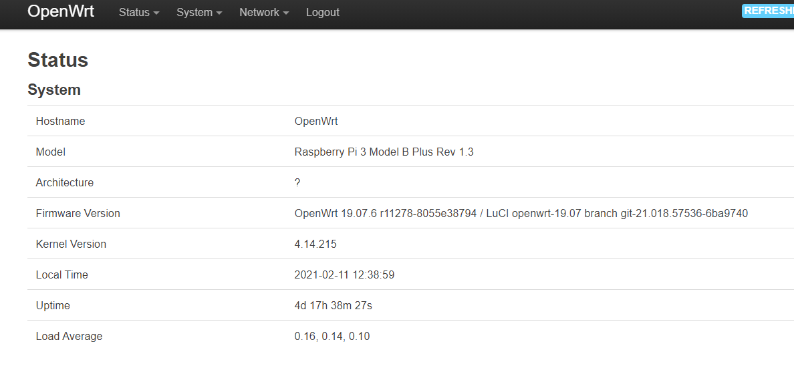
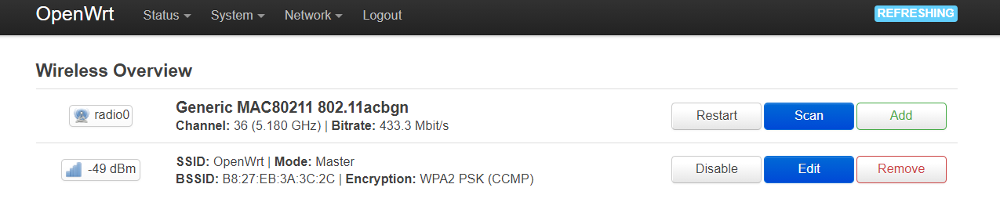
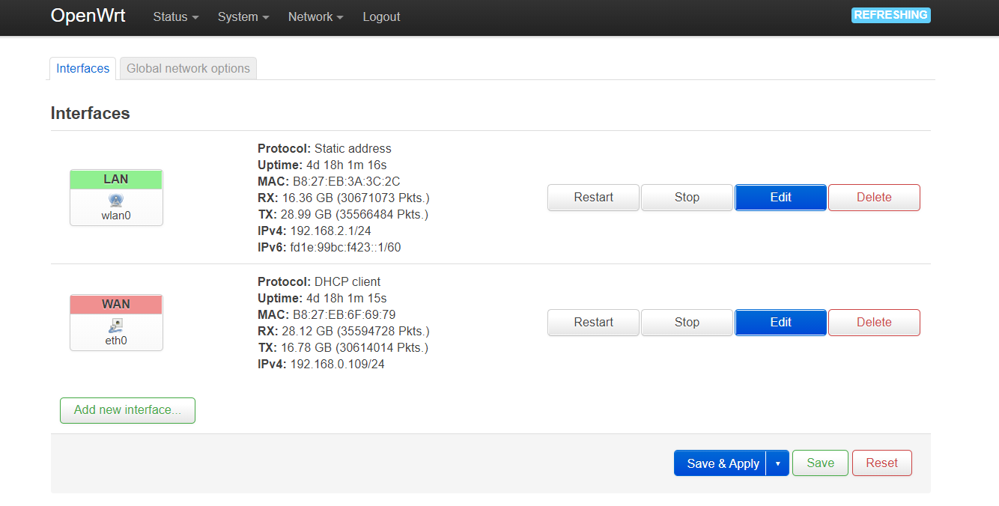

相关教程网上有很多，这里只是进行一个归纳，把自己当时用到的和自己遇到的坑写一下

硬件：树莓派3b+

系统：OpenWrt系统

目标：讲树莓派3b+配置为旁路由（不是主路由）

系统下载：[openwrt-19.07.6-brcm2708-bcm2710-rpi-3-ext4-factory.img](https://downloads.openwrt.org/releases/19.07.6/targets/brcm2708/bcm2710/)

本机采用Windows10系统

首先使用`SD Card Formatter`对TF卡进行格式化操作，然后使用`Win32DiskImager`对TF卡进行写入系统，随后将其插在树莓派上并启动即可。

用网线将树莓派和本机进行连接，在浏览器中访问`192.168.1.1`即可看到OpenWrt系统的界面，这表示系统安装成功，然后去（有的说是不需要网线连接，直接用本机搜索WiFi，名字是OpenWrt，但是我这个搜不到），在`system/Administration`里设置一下登录密码，在`Network/Wireless`中打开WiFi，这时就可以用无线网连接树莓派了





（WiFi重启命令`/etc/init.d/network restart`）

推荐使用终端修改，这里使用的是MobaXterm，主要是修改`/etc/config/network`里的配置信息，修改为如下配置，将树莓派的有线网卡修改为wan口，使用DHCP协议，树莓派的无线网卡修改为lan口，修改后重启再用终端连接的时候记得将IP地址改为lan口地址`192.168.2.1`，用网线连接一台路由器的lan口和树莓派的网口（即树莓派的wan口），然后连接树莓派的WiFi即可上网。

（这种配置方法是将路由器配置成旁路由，如果配置为主路由，树莓派wan口需要使用PPPOE协议，然后配置上网账号和密码，即可实现拨号上网）

```shell
root@OpenWrt:/etc/config# ls
dhcp      firewall  network   system    uhttpd
dropbear  luci      rpcd      ucitrack  wireless
root@OpenWrt:/etc/config# cat network

config interface 'loopback'
        option ifname 'lo'
        option proto 'static'
        option ipaddr '127.0.0.1'
        option netmask '255.0.0.0'

config globals 'globals'
        option ula_prefix 'fd1e:99bc:f423::/48'

config interface 'lan'
        #option type 'bridge'
        option ifname 'wlan0'
        option proto 'static'
        option ipaddr '192.168.2.1'
        option netmask '255.255.255.0'
        option ip6assign '60'

config interface 'wan'
        option proto 'dhcp'
        option ifname 'eth0'

root@OpenWrt:/etc/config#
```




完成上述之后，会发现OpenWrt系统的时间不是北京时间

可以通过修改`/etc/config/system`来完成，至于换源操作，没啥大问题，网上有很多

```shell
root@OpenWrt:/etc/config# cat system

config system
        option hostname 'OpenWrt'
        #option timezone 'UTC'
        option timezone Asia/Shanghai
        option timezone CST-8
        option ttylogin '0'
        option log_size '64'
        option urandom_seed '0'
```

还有一个问题是，用TF卡刷成OpenWrt系统后，会发现存储空间远远不足TF卡内存（本次使用的是16G的TF卡），可以使用`fdisk`指令对剩下存储进行分配可以参考下面的链接

https://blog.csdn.net/xjtumengfanbin/article/details/106871591


主要参考：

[树莓派3B安装OpenWrt打造超级路由器](https://www.cnblogs.com/hupo376787/p/12408182.html)

[树莓派3B安装OpenWrt作为旁路由](https://rongtianjie.me/archives/207)

[2020 | 树莓派刷openwrt打造旁路由器全攻略](https://vantageso.com/raspberry-openwrt-lu-you-qi/)

[2020 | 树莓派（吃灰派）刷大神改好的openwrt搭建旁路由](https://vantageso.com/raspberry-pi-openwrt-lu-you-qi-improvement/)

[openWRT 查看系统当前时间，以及更新系统时区为上海时间](https://blog.csdn.net/weixin_42396877/article/details/85925445)

[树莓派OpenWrt SD扩展问题](https://blog.csdn.net/xjtumengfanbin/article/details/106871591)